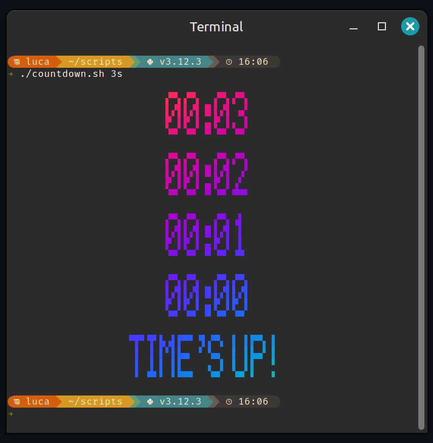

### ⌛ `countdown.sh`

A feature-rich, fully terminal-based countdown timer for Linux.

Uses **`toilet`** for text rendering and **`lolcat`** for smooth color gradients.
Accurate timing is handled by **`sleepenh`**, so even throttled output stays in sync with real time.

<p align="center">
  
</p>

#### ✨ Features

* Accepts flexible duration formats:

  * `SS`, `MM:SS`, `HH:MM:SS`
  * `45m`, `2h`, `1h30m20s`
  * ISO-8601 durations like `PT1H30M20S`
* `--until=<time>` or full `--until=<YYYY-MM-DDTHH:MM>` target
* Auto-rolls to next day if time is in the past
  (with optional confirmation or automatic notice)
* Adjustable **`--throttle`** (default **0.05s**) for smooth scrolling output
* **Centered output** by default (`--left` available)
* Default **font:** `standard` (you can specify any installed toilet font)
* Optional **`--clear`** for classic flicker updates
* Optional **sound at completion** (multiple fallback methods)
* **`--message`** to display a custom end screen
* **`--done-cmd`** to execute a command when time’s up
* Day-aware display for timers exceeding 24h
* Graceful suspend/resume handling (skips missed seconds)

---

#### ⚙️ Dependencies

Install all required packages:

```bash
sudo apt install toilet lolcat sleepenh
```

---

#### 🤖 Examples

```bash
# 10-minute timer
./countdown.sh 10m

# Until next 15:00 today (or tomorrow if past)
./countdown.sh --until=15:00

# ISO-8601 style
./countdown.sh PT2H30M

# Use a different font and clear screen each tick
./countdown.sh 3:00 digital --clear

# Run a command when finished
./countdown.sh 5 --done-cmd 'notify-send "Countdown finished!"'

# Silent run with scrolling text
./countdown.sh 2m --nosound
```

---

#### 🧪 Testing

An optional regression suite (`test_countdown.sh`) exercises all input formats and logic paths.
Run it from the same directory:

```bash
bash test_countdown.sh
```
